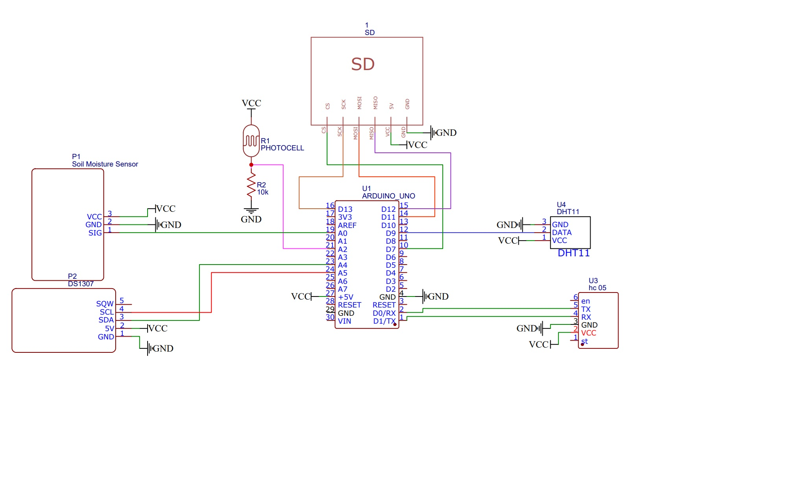

# 🌿 Умная Теплица на Arduino

Проект автоматизированной теплицы с возможностью ручного управления, логирования на SD-карту и синхронизацией времени через RTC.

## 🚀 Возможности

- 📊 Автоматический сбор данных с датчиков:
  - Температура и влажность воздуха (DHT11)
  - Влажность почвы (аналоговый датчик)
  - Освещённость (фоторезистор)
- 💡 Управление исполнительными устройствами:
  - Вентилятор
  - Насос для полива
  - Лампа
- 💾 Логирование данных:
  - На SD-карту (`log.txt`)
  - В сериал порт
- 🕒 RTC (часы реального времени):
  - Автоматическая установка времени при первом запуске
  - Форматированная дата и время
- ⚙️ Режим настройки (config mode):
  - Задание порогов через сериал-порт
  - Сохранение настроек на SD-карту (`setting.txt`)
- ✋ Ручной режим (`manual`):
  - Команды: `lamp=1`, `fan=0`, `pump=1` и т.д.
  - Команда `reboot` — удалённая перезагрузка
- 🧠 Защита:
  - Защита от ложного запуска помпы при старте
  - Сторожевой таймер (WDT) на случай зависания

## 📦 Список компонентов

| Компонент           | Назначение              |
|---------------------|--------------------------|
| Arduino Uno         | Основной контроллер      |
| DHT11               | Температура и влажность  |
| Аналоговый датчик   | Влажность почвы          |
| Фоторезистор        | Освещённость             |
| Модуль SD-карты     | Хранение логов и настроек|
| Troyka RTC (DS1307) | Часы реального времени   |
| Реле (3 шт.)        | Насос, вентилятор, лампа |
| Источник питания    | Питание схемы            |

## 🛠 Настройки через сериал

Подключитесь к Arduino через COM-порт и введите:

- config // Перейти в режим настройки
- light=400 // Порог срабатывания лампы
- moisture=600 // Порог влажности почвы (нижний)
- moistureMax=700 // Верхний предел влажности
- tempMax=30.0 // Порог включения вентилятора
- tempMin=25.0 // Порог отключения вентилятора
- save // Сохранить настройки
- run // Вернуться в рабочий режим

## ✋ Ручной режим

- manual // Войти в ручной режим
- lamp=1 // Включить лампу
- fan=0 // Выключить вентилятор
- pump=1 // Включить насос
- reboot // Перезагрузить устройство
- run // Вернуться в авто режим

## 🔧 Настройка платформы

- **Плата**: Arduino Uno
- **Библиотеки**:
  - `TroykaRTC`
  - `DHT`
  - `Adafruit_Sensor`
  - `GyverWDT`
  - `SD`, `SPI`, `Wire`

## 📈 Формат логов

Пример строки в `log.txt` и в Serial: 

- date=18.05.2025 time=10:44:41
- temp=29.90
- humidity=43.00
- moisture=674
- light=435
- fan=0
- lamp=0
- pump=1

## 🧰 Схема подключения

